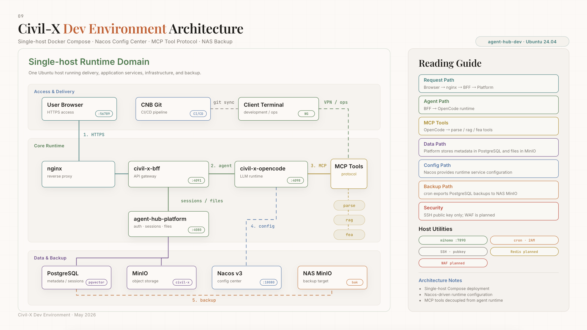

# Civil-X

> **从物理感知到决策建议** —— AI 驱动的土木工程智能分析平台

Civil-X 让土木工程师通过自然语言与 AI 协作：上传图纸、描述需求，AI 自动完成解析、知识检索、有限元仿真，生成分析报告。

## 路线图

当前阶段聚焦三个方向：

- **Runtime Gateway**：在 AI 服务和上层应用之间建立统一的代理层，抽象不同 runtime 版本差异，收敛 SSE 协议，支持多维度异常熔断与用量计量。
- **UAT 环境与上线准备**：完成 UAT 环境迁移、用户 token 计量计费、对话停止事件透传等上线前置事项。
- **技术债清偿**：Sidecar 迁移至 Gateway、MCP 回调替代轮询、跨服务链路追踪统一、opencode 版本升级评估。

具体任务与进度跟踪见 [GitHub Issues](https://github.com/Ayanami-Shinji/agent-hub-roadmap/issues)。
